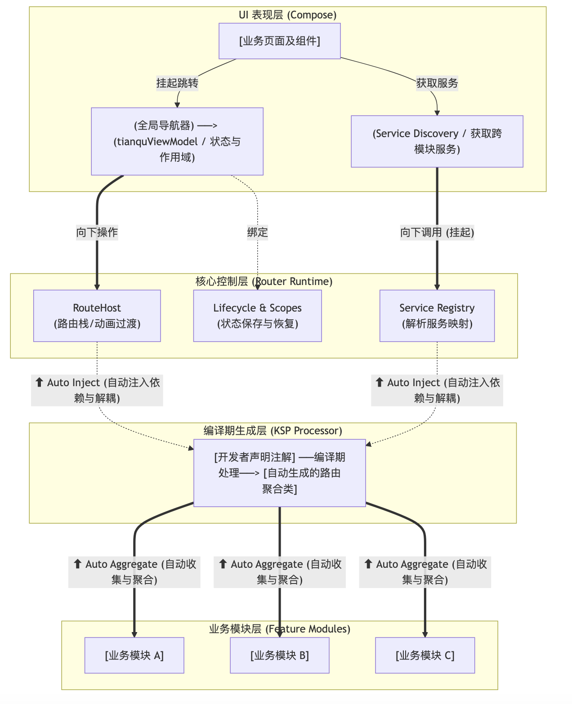

# 天衢路由 (TianQu) - Kotlin Multiplatform 路由框架

> **天衢**（tiān qú）出自《楚辞·九思·遭厄》：“蹑天衢兮长驱，踵九阳兮戏荡。”意为天上的大道，宽阔的通衢。寓意本框架为 Kotlin Multiplatform 跨平台开发提供一条平坦、宽广、畅通无阻的路由大道。

天衢 是一个专为 **Kotlin Multiplatform (KMP)** 打造的**纯 Kotlin + 协程驱动**的现代路由框架，支持 Android、iOS 以及桌面端。它彻底摆脱了传统 Android 路由框架对 JVM ASM 字节码插桩的依赖与深层嵌套的回调地狱，全面拥抱挂起函数，为您提供无侵入、强解耦、类型安全以及功能极其丰富的跨模块导航与服务发现解决方案。

---

## 🌟 核心特性概览

天衢路由最大的亮点在于**对 Kotlin 协程 (Coroutine) 的极致拥抱**。我们在核心架构的每一层都去除了传统的回调接口，采用挂起函数重构了复杂的异步流，带来了前所未有的开发体验：

1. **🚀 纯协程驱动的路由链路**：
   - **挂起式页面通信**：通过 `awaitNavigateForResult` 无阻塞等待下一个页面的返回值，彻底消灭 `onActivityResult` 的回调嵌套。
   - **挂起式路由守卫**：`RouterGuard` 的拦截方法为挂起方法，您可以在守卫中自由发起网络请求、下载动态模块或弹窗请求权限，无需额外的线程切换与闭包等待。
   - **挂起式全局降级**：`RouterHandler` 的 404 页面未找到或外部路由处理均为协程环境，轻松实现异步容错与重定向。
2. **纯 KSP 编译期扫描**：完全无侵入，无需手动注册，支持增量编译。
3. **全自动跨模块聚合**：业务模块按需生成子路由表，App 主模块自动聚合所有子模块，彻底解决多模块组件化难题。
4. **强大的传参机制**：支持 URL Path 变量 (`/user/{id}`)、Query 参数 (`?id=1`)、**复杂大对象 (`extra`)** 以及**基于数据类的强类型安全传递**。
5. **跨模块服务发现**：轻松实现接口下沉与依赖反转，提供优雅的 `rememberService<T>()` 协程安全挂起加载，确保服务单例的线程与协程安全。
6. **生命周期与 ViewModel 绑定**：内置专属页面作用域，提供 `tianquViewModel<T>()`。支持跨平台无反射的 `@InjectViewModel` 自动依赖注入 `tianQuViewModelInject<T>()`，当页面出栈时，不仅自动销毁 ViewModel，还会**自动取消其绑定的所有协程任务**，彻底告别内存泄漏与空指针。
7. **并发预加载引擎**：内置基于 `CompletableDeferred` 的非阻塞预加载器 (`RoutePreloader`)。在转场动画播放的同时，后台协程高并发加载目标页数据，实现“瞬开”体验。
8. **离线 DeepLink 意图缓存**：内置基于协程无界 `Channel` 的意图队列。冷启动或多线程高频触发外部唤起时，底层协程会自动缓冲并按序消费路由，绝不丢失任何一次跳转意图。
9. **高级导航表现**：内置单例模式控制、多返回栈（无缝衔接底层 Tab 栏）、自定义动画过渡、Compose 共享元素动画 (Shared Element) 及 404 全局降级。

---

## 🏗️ 框架架构图


### 架构说明：

1. **业务模块层 (Feature Modules)**: 开发者在各个独立的业务模块（如 Login、Home、Settings）中，使用 `@Router` 标注 Compose 页面，并可结合 `@Transition` 注解高度定制页面的进出场动画与层级。使用 `@Service` 标注需要对外暴露的服务实现类。这些模块之间**互不依赖**，实现彻底的物理隔离与解耦。
2. **编译期生成层 (KSP Processor)**: KSP 会在编译期扫描上述注解，为每个业务模块生成对应的子路由表与服务表。在 App 主模块中，KSP 会自动将所有子模块的路由表与服务表聚合成一个完整的 `RouterRegistry`，整个过程对性能无影响，且无需开发者手动注册。
3. **核心控制层 (Router Runtime)**: 全面拥抱**协程 (Coroutine)** 设计。
    * **RouterHost**: 负责管理页面的导航栈（返回栈、多Tab栈等），并结合 `@Transition` 提供的动画元数据实现 Compose 动画切换与精细化过渡。
    * **Service Registry & RouterContext**: 存储并管理由 KSP 自动注入的跨模块接口与实现类的映射关系。全局通过 `RouterContext` 提供上下文环境管理，无论是服务获取还是事件分发都在此安全运转。
    * **Lifecycle & Scopes**: 借助 Compose 的 `SaveableStateHolder` 实现每个页面的状态保持，并为每个页面维护独立的生命周期与**协程作用域 (CoroutineScope)**。挂起函数与底层协程生命周期同生共死。
4. **UI 表现层 (Compose)**: 开发者在业务界面的 UI 中，通过访问全局的 `Navigator` 对象发起页面跳转（并可通过**协程挂起**无缝等待返回值）；通过 `rememberService<T>()` 获取跨模块通信接口；并通过 `tianquViewModelInject()` 挂载受页面生命周期严格管控并自动注入的 ViewModel，当页面从路由栈移除时，对应的协程作用域和 ViewModel 会自动释放。

---

## 📦 一、引入与配置

目前可通过Maven Central 引入最新版 天衢 路由依赖：

在项目根目录或 `gradle/libs.versions.toml` 中配置：

```toml
[versions]
tianqu-router-annotations = "1.0.3" # 替换为最新版本号
tianqu-router-processor = "1.0.3"
tianqu-router-runtime = "1.0.3"
ksp = "2.1.10-1.0.31" # 请务必与您项目的 Kotlin 版本一致

[libraries]
tianqu-router-annotations = { module = "io.gitee.zhongte:tianqu-router-annotations", version.ref = "tianqu-router-annotations" }
tianqu-router-processor = { module = "io.gitee.zhongte:tianqu-router-processor", version.ref = "tianqu-router-processor" }
tianqu-router-runtime = { module = "io.gitee.zhongte:tianqu-router-runtime", version.ref = "tianqu-router-runtime" }

[plugins]
ksp = { id = "com.google.devtools.ksp", version.ref = "ksp" }
```

### 1. 业务子模块配置 (Feature Module)
子模块需要依赖 `annotations` 注解库和运行时库，并应用 KSP 处理器来生成自身的路由表。同时可以通过 KSP 参数 `tianqu.moduleName` 指定生成的类名前缀。
**注意：必须配置 Java 17 并在 `commonMain` 中添加 KSP 生成的代码目录，否则会导致编译时找不到生成的类。**

```kotlin
// feature-a/build.gradle.kts
plugins {
    alias(libs.plugins.kotlinMultiplatform)
    alias(libs.plugins.composeMultiplatform)
    alias(libs.plugins.ksp) // 引入 KSP
}

kotlin {
    // 确保编译目标使用 Java 17
    jvmToolchain(17) 
    // 或者在 androidTarget/jvm 中显式指定 jvmTarget = "17"

    sourceSets {
        commonMain.dependencies {
            implementation(libs.tianqu.router.annotations) // 注解库
            implementation(libs.tianqu.router.runtime) // 运行时库
        }
    }
}

// 【必填项】：为该模块生成的 Router 注册类指定模块前缀，建议直接使用 project.name 动态获取
ksp {
    arg("tianqu.moduleName", project.name)
}

dependencies {
    add("kspCommonMainMetadata", libs.tianqu.router.processor)
}

// 【必填项】：将 KSP 生成的代码目录添加到 commonMain 的 source sets 中
kotlin.sourceSets.commonMain {
    kotlin.srcDir("build/generated/ksp/metadata/commonMain/kotlin")
}

// 【必填项】：确保所有 Kotlin 编译任务在 KSP 生成 metadata 之后执行
tasks.withType<org.jetbrains.kotlin.gradle.dsl.KotlinCompile<*>>().configureEach {
    if (name != "kspCommonMainKotlinMetadata") {
        dependsOn("kspCommonMainKotlinMetadata")
    }
}
```

### 2. 主工程模块配置 (App Module) 【极其重要❗】
主工程除了依赖 `runtime` 核心库外，**必须在 KSP 配置中声明自己为 App 模块**，并且同样需要配置 Java 17 和 KSP 代码生成目录关联。

```kotlin
// composeApp/build.gradle.kts
plugins {
    alias(libs.plugins.ksp)
}

// 【必填项】：告知处理器当前模块为主工程，需要聚合全工程路由表
ksp {
    arg("tianqu.moduleName", project.name)
    arg("tianqu.isApp", "true") 
}

kotlin {
    jvmToolchain(17)

    sourceSets {
        commonMain.dependencies {
            implementation(libs.tianqu.router.annotations)
            implementation(libs.tianqu.router.runtime) // 必须引入 Runtime
            
            // 依赖你的所有业务模块
            implementation(project(":feature-a"))
            implementation(project(":feature-b"))
        }
    }
}

dependencies {
    add("kspCommonMainMetadata", libs.tianqu.router.processor)
}

// 【必填项】：将 KSP 生成的聚合路由表代码目录添加到 commonMain 的 source sets 中
kotlin.sourceSets.commonMain {
    kotlin.srcDir("build/generated/ksp/metadata/commonMain/kotlin")
}

// 【必填项】：确保 KSP 任务优先执行
tasks.withType<org.jetbrains.kotlin.gradle.dsl.KotlinCompile<*>>().configureEach {
    if (name != "kspCommonMainKotlinMetadata") {
        dependsOn("kspCommonMainKotlinMetadata")
    }
}
```

---

## 🚀 二、基础路由导航与全局初始化

### 1. 全局初始化 RouterHost
在 Compose Multiplatform 的共享 UI 层 (`App.kt`) 根节点，创建 `Navigator` 并使用 `RouterHost` 承载。框架支持拦截器(Guards)和全局事件监听(如404处理)。

```kotlin
// App.kt
import shijing.tianqu.router.generated.GlobalRouteAggregator
import shijing.tianqu.runtime.*
import shijing.tianqu.runtime.service.ServiceManager

@Composable
fun App() {
    // 1. 初始化跨模块 Service 通信大表
   ServiceManager.init(GlobalRouteAggregator.services)

   // 示例：创建一个简单的局部路由守卫（只拦截特定路由）
   val guards = remember {
      listOf(
         object : RouterGuard {
            // 重写 matches 方法，实现局部拦截
            override fun matches(context: RouterContext): Boolean {
               // 仅当跳转到带有 /user 的路径时才触发此守卫
               return context.url.startsWith("/user")
            }

            override suspend fun canActivate(context: RouterContext, chain: GuardChain): Boolean {
               println("🚀 [局部拦截器] 发现正在尝试进入 User 模块，URL: ${context.url}")
               return chain.proceed(context) // 放行并交给下一个守卫
            }
         }
      )
   }
   
    // 2. 创建并记住 Navigator 实例，指定起始页与路由表
    val navigator = rememberNavigator(
        routes = GlobalRouteAggregator.routers,
        startRoute = "/main_tab", // 启动页
       guards = guards
    )

    MaterialTheme {
        // 3. 将 navigator 注入 RouteHost
        RouterHost(navigator = navigator)
    }
}
```

### 2. 获取 Navigator 的多种方式
除了通过 CompositionLocal 获取，如果您处于协程作用域内，还可以直接从上下文中提取！

```kotlin
import shijing.tianqu.router.Router
import shijing.tianqu.router.RouterContext
import shijing.tianqu.runtime.LocalNavigator
import shijing.tianqu.runtime.rememberRouterScope
import shijing.tianqu.runtime.Navigator
import kotlinx.coroutines.launch

@Router(path = "/home", transition = "Fade") // 可选设置动画
@Composable
fun HomeScreen(context: RouterContext) {
    // 方式一：在 Compose 作用域内获取 (最常用)
    val navigator = LocalNavigator.current
    
    // 方式二：在挂起函数 / 专属协程作用域内获取 (极客玩法)
    val routerScope = rememberRouterScope()
    
    Button(onClick = {
        routerScope.launch {
            // 通过协程上下文直接提取当前的 Navigator
            val nav = coroutineContext[Navigator] ?: return@launch
            nav.navigateTo("/profile")
        }
    }) {
        Text("跳转个人资料页")
    }
}
```

### 3. 物理返回键/侧滑手势返回拦截 (Android/iOS)
在 Android 上，通常需要拦截系统的物理返回键；在 iOS 上，则是侧滑返回。框架可以通过简单的代码与系统的返回机制打通。

**第一步：基于 `expect/actual` 桥接跨平台 `BackHandler`**

因为 Compose Multiplatform 官方暂未在 `commonMain` 中提供直接对应的拦截器，我们需要自行桥接：

```kotlin
// 1. 在 commonMain 中定义 expect 函数
@Composable
expect fun BackHandler(enabled: Boolean = true, onBack: () -> Unit)

// 2. 在 androidMain 中实现 actual (直接委托给 Android 的 Activity Compose)
@Composable
actual fun BackHandler(enabled: Boolean, onBack: () -> Unit) {
    androidx.activity.compose.BackHandler(enabled = enabled, onBack = onBack)
}

// 3. 在 iosMain 中实现 actual
@Composable
actual fun BackHandler(enabled: Boolean, onBack: () -> Unit) {
    // iOS 通常由原生的 UINavigationController 处理侧滑，也可在此桥接手势返回事件
}
```

**第二步：在主入口拦截后退事件**

建议在 `App.kt` 最外层配置上述全局的 `BackHandler`：

```kotlin
@Composable
fun App() {
    val navigator = rememberNavigator(
        routes = GlobalRouteAggregator.routers,
        startRoute = "/main_tab"
    )

    // 支持物理返回键 / 手势返回（当导航栈中多于1个页面时启用拦截并执行出栈）
    BackHandler(enabled = navigator.backStack.size > 1) {
        navigator.pop()
    }

    MaterialTheme {
        RouterHost(navigator = navigator)
    }
}
```

> **💡 多层嵌套拦截提示**：由于 Compose 的 `BackHandler` 遵循“就近拦截（子优先）”原则。如果您在某个深层子页面（例如填写表单页）也调用了自定义的 `BackHandler`，它会优先消费返回事件，完美覆盖全局的这个默认退栈逻辑，不会产生冲突！

### 4. 自定义页面切换动画
天衢 路由内置了常见的转场动画（如 `Fade`, `Slide`, `Scale`, `None`），默认使用的是`Slide`，这是安卓上经典的页面切换动画。如果您需要极其炫酷的自定义动画，可以直接使用 `@Transition` 注解和 `BaseTransitionStrategy` 轻松实现，且完全支持 Compose 官方的动画 API！

**实现步骤：**
1. 继承 `BaseTransitionStrategy` 并重写入场/出场动画。
2. 使用 `@Transition` 注解标记，并起一个引用名称。
3. 在目标页面的 `@Router` 注解中使用这个名称。

```kotlin
import androidx.compose.animation.*
import androidx.compose.animation.core.tween
import shijing.tianqu.router.Router
import shijing.tianqu.router.Transition
import shijing.tianqu.runtime.transition.BaseTransitionStrategy

// 1. 定义自定义动画策略
@Transition(name = "RotateScale")
class RotateScaleTransitionStrategy : BaseTransitionStrategy() {
    
    // 入场动画：缩放并淡入
    override fun getEnterTransition(
        scope: AnimatedContentTransitionScope<StackEntry>,
        initial: StackEntry,
        target: StackEntry,
        isPop: Boolean
    ): EnterTransition {
        return scaleIn(initialScale = 0.5f, animationSpec = tween(500)) + 
               fadeIn(animationSpec = tween(500))
    }

    // 出场动画：缩放并淡出
    override fun getExitTransition(
        scope: AnimatedContentTransitionScope<StackEntry>,
        initial: StackEntry,
        target: StackEntry,
        isPop: Boolean
    ): ExitTransition {
        return scaleOut(targetScale = 1.5f, animationSpec = tween(500)) + 
               fadeOut(animationSpec = tween(500))
    }
}

// 2. 在页面路由中引用它
@Router(path = "/demo_anim", transition = "RotateScale")
@Composable
fun DemoAnimScreen(context: RouterContext) {
    // 页面内容...
}
```
KSP 会自动将您的自定义动画收集到聚合器中，跳转时无缝衔接。

---

## 🎯 三、传参大满贯：各种传参场景与代码示例

天衢 路由全面覆盖了不同场景的数据传递需求，不再有传统框架传参类型容易丢失的问题。

### 场景一：基于 URL 的基础类型传参 (Path & Query)
适用于深层链接 (DeepLink) 直接唤起 App，或者简单的 ID、状态位传递。

**发起跳转：**
```kotlin
// 跳转并拼接 Path 与 Query 参数
navigator.navigateTo("app://shijing.tianqu/user/1001?source=home_banner&vip=true")
```

**目标页面解析参数：**
```kotlin
@Router(path = "/user/{id}")
@Composable
fun UserDetailScreen(context: RouterContext) {
    // 1. 从 context.pathParams 获取路径里的 {id}
    val userId = context.pathParams["id"]
    
    // 2. 从 context.queryParams 获取问号后的参数 (注意是 List，因为可能存在多个同名 key)
    val source = context.queryParams["source"]?.firstOrNull()
    val isVip = context.queryParams["vip"]?.firstOrNull()?.toBoolean() ?: false
    
    Text("用户ID: $userId, 来源: $source, VIP: $isVip")
}
```

### 场景二：传递内存级别复杂大对象 (Extra)
对于**非序列化、直接传递**的大对象（例如 Bitmap，或某些体积巨大、不方便格式化的类实例），可以直接通过 `extra` 字段传递。

**发起跳转：**
```kotlin
// 定义任意业务模型
data class UserProfile(val name: String, val age: Int, val isVip: Boolean)

// 使用 extra 传递对象
val profile = UserProfile(name = "Kotlin开发者", age = 25, isVip = true)
navigator.navigateTo("/profile", extra = profile)
```

**目标页面安全解包：**
```kotlin
@Router(path = "/profile")
@Composable
fun ProfileScreen(context: RouterContext) {
    // 使用 as? 进行安全的类型强转
    val profileData = context.extra as? UserProfile

    if (profileData != null) {
        Text("你好，${profileData.name}，年龄 ${profileData.age}")
    } else {
        Text("未接收到复杂参数对象")
    }
}
```

### 场景三：基于 Kotlinx.serialization 的强类型安全传参
如果希望享受绝对的类型安全检查，支持序列化并严防类型错误，请使用强类型传参。

**前置准备：引入序列化插件与依赖**

在项目根目录或 `gradle/libs.versions.toml` 中配置：
```toml
[versions]
kotlinx-serialization = "1.6.3"

[libraries]
# 序列化
kotlinx-serialization-json = { module = "org.jetbrains.kotlinx:kotlinx-serialization-json", version.ref = "kotlinx-serialization" }

[plugins]
ksp = { id = "com.google.devtools.ksp", version.ref = "ksp" }
# 序列化插件
kotlinSerialization = { id = "org.jetbrains.kotlin.plugin.serialization", version.ref = "kotlin" }
```
在需要使用强类型传参的模块的 `build.gradle.kts` 中，引入 Kotlin 官方的序列化插件及运行库：
```kotlin
plugins {
   alias(libs.plugins.kotlinMultiplatform)
   alias(libs.plugins.androidApplication)
   alias(libs.plugins.composeMultiplatform)
   alias(libs.plugins.composeCompiler)
   alias(libs.plugins.ksp) 
   // 引入序列化插件
   alias(libs.plugins.kotlinSerialization)
}

kotlin {
    sourceSets {
        commonMain.dependencies {
           implementation(libs.tianqu.router.annotations)
           implementation(libs.tianqu.router.runtime)
           // 添加依赖
           implementation(libs.kotlinx.serialization.json)
        }
    }
}
```

**步骤 1：定义可序列化的数据类**
```kotlin
import kotlinx.serialization.Serializable

@Serializable
data class UserDetailArgs(
    val userId: Long,
    val username: String,
    val isVip: Boolean,
    val scores: List<Int>
)
```

**步骤 2：发起强类型安全跳转 (`navigateArgs`)**
```kotlin
// 使用 navigateArgs 方法
navigator.navigateArgs(
    path = "/typesafe_demo",
    args = UserDetailArgs(
        userId = 999L, 
        username = "天衢路由", 
        isVip = true, 
        scores = listOf(100, 98)
    )
)
```

**步骤 3：目标页面强类型提取 (`getTypedArgs<T>()`)**
```kotlin
import shijing.tianqu.runtime.getTypedArgs

@Router(path = "/typesafe_demo")
@Composable
fun TypeSafeScreen(context: RouterContext) {
    // 根据泛型类型自动反序列化，如果解析失败或缺失则为 null
    val args = context.getTypedArgs<UserDetailArgs>()
    
    if (args != null) {
        Text("✅ 类型安全解析成功！用户名: ${args.username}")
    }
}
```

---

## ⚡️ 四、极致性能：非阻塞并发数据预加载 (Route Pre-fetching)

传统的页面开发模式往往面临两难选择：要么**先跳转再请求**（进入页面后有一段骨架屏/Loading空白期等待数据），要么**先请求再跳转**（用户点击按钮后界面卡住无响应，等数据回来了才突然跳转）。

天衢 路由作为一款**基于协程驱动**的现代框架，彻底解决了这个问题！我们提供了**页面跳转与数据加载并发执行**的预加载能力：
在执行 `navigateTo` 的**毫秒级瞬间**，底层会通过 `async` 启动预加载协程，并在同时播放页面的 Compose 转场动画。我们完美利用了动画过渡的 300~500 毫秒“空窗期”，等动画播完时，数据往往已经加载完毕，实现真正的**“零秒开启、无缝平滑”**极致体验。完全不阻塞主线程！

**步骤 1：定义你的预加载器 (实现 `RoutePreloader`)**
```kotlin
class UserDetailPreloader : RoutePreloader {
    override suspend fun preload(context: RouterContext): Any? {
        val userId = context.pathParams["id"] ?: return null
        println("🚀 [后台线程] 开始预加载用户 $userId 的详细数据...")
        
        // 模拟耗时网络请求（此挂起不会阻塞 UI 线程与转场动画！）
        delay(500)
        
        return UserDetailArgs(userId = userId.toLong(), username = "预加载大神", isVip = true, scores = emptyList())
    }
}
```

**步骤 2：注册到 Navigator 初始化中**
```kotlin
// 一定要先创建对象
val preloaders = remember { mapOf("/demo_preload" to UserDetailPreloader()) }

val navigator = rememberNavigator(
    routes = GlobalRouteAggregator.routers,
    startRoute = "/home",
    preloaders = preloaders // 绑定路由路径与对应的预加载器
)
```
请注意，不能通过下面的代码传递预加载器。 直接写 preloaders = mapOf(...)，这意味着每次重组时都会创建一个新的 Map 对象。
rememberNavigator 会根据参数（包括 preloaders）来 remember 导航器。
因为传进去的 Map 对象一直在变，导致 Compose 认为参数变了，从而不断地重新创建 Navigator 对象并清空页面栈，最终表现出来的就是不断刷新的“白屏”。
```kotlin
// 错误示例
val navigator = rememberNavigator(
    routes = GlobalRouteAggregator.routers,
    startRoute = "/home",
    preloaders = mapOf("/demo_preload" to UserDetailPreloader()) // 这是错误的写法
)
```
如果不想在启动的时候就传递预加载器，可以在通过下面的方式
```kotlin
// 在跳转之前传递预加载器
navigator.registerPreloader("/demo_preload", UserDetailPreloader())
navigator.navigateTo("/demo_preload")
```
**步骤 3：在目标页面一键提取数据 (`rememberPreloadData<T>()`)**
无需关心复杂的协程等待逻辑，框架在底层已经将获取到的 `Deferred` 无缝传递给了页面，使用即可：
```kotlin
@Router(path = "/user_detail/{id}")
@Composable
fun UserDetailScreen(context: RouterContext) {
    // 🌟 在 Compose 中非阻塞地挂起等待预加载结果
    val preloadedData = rememberPreloadData<UserDetailArgs>()

    if (preloadedData == null) {
        // 动画期间，由于数据还在飞奔请求中，可能会短暂显示 Loading
        CircularProgressIndicator()
    } else {
        // 数据到达，直接渲染！此时转场动画可能刚巧播完，完美衔接！
        Text("加载完毕，用户：${preloadedData.username}")
    }
}
```

---

## 🔄 五、页面结果回传 (页面间双向通信)

处理“选择联系人”、“修改设置后返回数据”等需求时，天衢 提供了极为优雅的挂起式协程解决方案。

### 1. 目标页：如何发送返回值并返回？
无论调用方采用哪种方式，目标页面只需要调用 `popBackStack(result)` 即可！它支持传递**任何类型**的对象。

```kotlin
@Router(path = "/settings")
@Composable
fun SettingsScreen() {
    val navigator = LocalNavigator.current
    
    Button(onClick = {
        // 关闭当前页面，并将字符串对象作为结果弹回上一个页面
        navigator.popBackStack(result = "这里是修改后的最新设置数据")
    }) {
        Text("保存并返回")
    }
}
```

### 2. 调用方做法一：协程挂起式 (`awaitNavigateForResult`) 【⭐ 强烈推荐】
告别嵌套“地狱回调”，像写同步代码一样写异步等待！
*(⚠️ 警告：请务必在与页面生命周期绑定的 `navigator.coroutineScope` 内启动协程，否则可能会因为屏幕重组导致协程取消！)*

```kotlin
val navigator = LocalNavigator.current
var returnedResult by rememberSaveable { mutableStateOf<String?>(null) }

Button(onClick = {
    // 启动伴随页面的安全协程
    navigator.coroutineScope.launch {
        // 🌟 代码在此处挂起！直到用户从设置页返回才会继续往下执行，非阻塞主线程
        val result = navigator.awaitNavigateForResult("/settings")
        
        // 检查返回值类型并消费
        if (result is String) {
            returnedResult = "协程获取: $result"
        }
    }
}) {
    Text("前往设置页 (等待结果)")
}

if (returnedResult != null) {
    Text("收到返回值: $returnedResult")
}
```

### 3. 调用方做法二：经典回调监听 (`navigateWithResult`)
如果您处于非协程环境（如对接特定的 Swift 闭包），或个人偏爱经典回调：

```kotlin
Button(onClick = {
    navigator.navigateWithResult("/settings").onResult { result ->
        if (result is String) {
            returnedResult = "回调获取: $result"
        }
    }
}) {
    Text("前往设置页 (回调获取结果)")
}
```

---

## 🔌 六、跨模块解耦：服务发现 (Service Discovery)

路由不仅为了页面跳转，也是为了跨模块间的**接口调用与反向依赖注入**。上层 `app` 可以调用底层 `feature` 模块的具体实现，而无需互相强依赖。

### 1. 定义接口 (放在基础 Common 模块)
```kotlin
interface UserService {
    suspend fun getUserName(): String
}
```

### 2. 具体实现 (放在具体的 Feature 模块)
添加 `@Service` 注解，KSP 处理器会自动将其注册到服务表中。
```kotlin
import shijing.tianqu.router.Service

@Service
class UserServiceImpl : UserService {
    override suspend fun getUserName(): String {
        return "天衢注册用户"
    }
}
```

### 3. 在任意位置获取服务 (支持挂起与普通获取)
天衢 提供了两种灵活的方式来获取服务实例：

**方式一：在 Compose 中基于协程挂起获取 (`rememberService`)**
结合 Compose 最佳实践，无阻塞安全获取。
```kotlin
import shijing.tianqu.runtime.utils.rememberService

@Composable
fun HomeScreen() {
    // 🔥 自动安全挂起加载，支持自动重组
    val userService = rememberService<UserService>()
    
    // 因为服务加载可能需要时间，使用安全调用符处理空状态
    val userName = userService?.getUserName() ?: "正在异步加载..."
    
    Text("欢迎您, $userName")
}
```

**方式二：在任意非 Compose 代码中普通获取 (`ServiceManager.getService`)**
如果您在 ViewModel、Repository 或是普通的方法中，希望直接拿到服务实例：
```kotlin
import shijing.tianqu.runtime.service.ServiceManager

fun fetchUserData() {
    // 返回对应的实现类，如果不存在则抛出异常或返回null (具体看您的封装)
    val userService = ServiceManager.getService<UserService>()
    
    // 如果您在普通协程里，也有挂起函数版本：
    // val userService = ServiceManager.getServiceAsync<UserService>()
}
```

---

## 🧬 七、ViewModel 与页面生命周期深度绑定

原生的 `viewModel()` 在纯 Compose Multiplatform 项目中往往缺乏路由弹栈感知能力。TianQu 提供了与**单次页面路由同生共死**的专有 ViewModel，并支持三种不同的获取方式，满足各种复杂场景的需求。

### 1. 声明标准的 ViewModel
```kotlin
import androidx.lifecycle.ViewModel
import kotlinx.coroutines.flow.MutableStateFlow

class CounterViewModel : ViewModel() {
    val count = MutableStateFlow(0)

    init { println("ViewModel 初始化分配") }
    
    // 🌟 当该路由页面被 pop 出栈时，此方法自动触发，释放内存！
    override fun onCleared() {
        super.onCleared()
        println("该页面已被销毁，释放各种流与资源！")
    }
}
```

### 2. 获取 ViewModel 的三种方式

在路由页面中，您可以通过以下三种方式获取与当前页面生命周期绑定的 ViewModel：

#### 方式一：反射无参构造获取 (`tianquViewModel<T>()`)

最简单直接的方式，适用于 ViewModel 只有无参构造函数的情况。在 JVM/Android 平台上通过反射实例化。

```kotlin
import shijing.tianqu.runtime.tianquViewModel

@Router(path = "/demo_viewmodel")
@Composable
fun DemoViewModelScreen() {
    // 自动通过反射调用无参构造函数创建 ViewModel
    val viewModel = tianquViewModel<CounterViewModel>()
    // ...
}
```
* **优点**：使用极其简单，无需额外配置，开箱即用。
* **缺点**：依赖反射机制，**在 iOS 等 Kotlin/Native 平台上不支持无参反射实例化，会导致 Crash**；不支持带参数的构造函数。

#### 方式二：自定义 Factory 获取 (`tianquViewModel<T>(factory)`)

适用于 ViewModel 需要传递参数（如 Repository、UseCase）或在 iOS 平台上运行的情况。

```kotlin
import shijing.tianqu.runtime.tianquViewModel
import androidx.lifecycle.ViewModelProvider
import androidx.lifecycle.viewmodel.CreationExtras
import kotlin.reflect.KClass

// 自定义 Factory
class CounterViewModelFactory : ViewModelProvider.Factory {
    override fun <T : ViewModel> create(modelClass: KClass<T>, extras: CreationExtras): T {
        return CounterViewModel() as T // 如果有参数，可以在这里传入
    }
}

@Router(path = "/demo_viewmodel")
@Composable
fun DemoViewModelScreen() {
    // 传入自定义 Factory 进行实例化
    val viewModel = tianquViewModel<CounterViewModel>(factory = CounterViewModelFactory())
    // ...
}
```
* **优点**：灵活性最高，支持带参数的构造函数；**完全兼容所有平台（包括 iOS）**。
* **缺点**：每次使用都需要手动编写和传入 Factory，样板代码较多，略显繁琐。

#### 方式三：基于 KSP 的全自动依赖注入 (`tianQuViewModelInject<T>()`) 【⭐ 强烈推荐】

结合了前两者的优点，通过 `@InjectViewModel` 注解在编译期生成工厂代码，实现无反射、跨平台的自动注入。

**步骤 A：在 ViewModel 上添加注解**
```kotlin
import shijing.tianqu.router.InjectViewModel

@InjectViewModel // 🌟 标记此 ViewModel 需要生成注入工厂
class CounterViewModel : ViewModel() {
    // ...
}
```

**步骤 B：在页面中一键获取**
```kotlin
import shijing.tianqu.runtime.tianQuViewModelInject

@Router(path = "/demo_viewmodel")
@Composable
fun DemoViewModelScreen() {
    // 底层自动从 ServiceLocator 获取生成的工厂并实例化，无需反射！
    val viewModel = tianQuViewModelInject<CounterViewModel>()
    // ...
}
```
* **优点**：**无反射（性能极佳）、完全跨平台（完美支持 iOS）、无样板代码（使用极其简单）**。
* **缺点**：目前生成的默认工厂仅支持无参构造函数（若需带参构造，请继续使用方式二）。

---

**💡 内存泄漏终结者**：无论您使用哪种方式获取，**当点击返回，当前页面被 `popBackStack` 移出栈时，框架将主动触发 ViewModel 的 `onCleared()`，杜绝任何内存泄漏。**

---

## 🧩 八、协程驱动的动态按需懒加载 (Dynamic Feature)

在大型项目中，为了减小包体积或加快初始启动速度，某些业务模块可以设计为**动态下载与按需加载**。在传统路由中，这往往需要复杂的异步回调与占位页面。

而在 天衢 路由中，得益于底层的协程 `suspend` 架构与强大的全局守卫 (`RouterGuard`)，您可以像写同步代码一样轻松实现**带有等待 UI 的动态模块加载**。

**核心原理：**
1. 业务层调用挂起函数 `navigator.push("/dynamic_route")`，并在协程外层控制 "Loading 转圈" UI 状态。
2. 路由框架进行匹配，发现目标路由不存在。
3. 全局 `RouterGuard` 拦截到请求，判断该 URL 属于某个未加载的模块。
4. **守卫在内部使用 `suspend` 挂起执行下载逻辑（如下载 js bundle、加载 dex、或从服务器拉取配置）。**
5. 下载完成后，守卫动态注册新模块的路由表：`navigator.registerDynamicRoutes(...)`。
6. 守卫返回 `true`，拦截器放行。
7. 框架自动完成向目标页面的跳转。
8. 业务层 `navigator.push` 挂起恢复，隐藏 "Loading" 状态。

**完整演示代码：**

```kotlin
// 1. 定义动态加载守卫
class DynamicFeatureGuard : RouterGuard {
    // 拦截特定前缀的路由
    override fun matches(context: RouterContext): Boolean {
        return context.url.startsWith("/dynamic_feature")
    }

    override suspend fun canActivate(context: RouterContext, chain: GuardChain): Boolean {
        val navigator = chain.navigator
        // 判断路由表中是否已经有了该页面，如果没有才需要模拟下载
        if (navigator.backStack.none { it.url == context.url } &&
            !navigator.hasRoute(context.url)) {
            
            println("正在异步下载并加载动态模块...")
            // 模拟真实环境下的网络下载耗时
            delay(2000)
            
            // 下载完成后，动态将新模块的节点注册进当前导航器中
            navigator.registerDynamicRoutes(listOf(
                RouterNode(
                    path = "/dynamic_feature",
                    composable = { ctx -> DynamicFeatureScreen(ctx) }
                )
            ))
            println("动态模块加载完毕，路由已注册！")
        }
        
        // 模块已就绪，放行
        return chain.proceed(context)
    }
}

// 2. 业务侧发起调用并展示 Loading UI
@Composable
fun HomeScreen() {
    val navigator = LocalNavigator.current
    val coroutineScope = rememberCoroutineScope()
    // 维护按钮的加载状态
    var isDynamicLoading by rememberSaveable { mutableStateOf(false) }

    Button(
        onClick = {
            coroutineScope.launch {
                isDynamicLoading = true // 1. 显示转圈
                // 2. 使用 suspend 的 push()，它会等待所有异步守卫（包含下载）执行完毕
                navigator.push("/dynamic_feature")
                isDynamicLoading = false // 3. 页面跳转成功或被拒绝后，隐藏转圈
            }
        }
    ) {
        if (isDynamicLoading) {
            CircularProgressIndicator(modifier = Modifier.size(20.dp), color = Color.White)
            Spacer(modifier = Modifier.width(8.dp))
            Text("正在下载模块...")
        } else {
            Text("✨ 动态按需加载模块")
        }
    }
}
```
通过这种方式，我们不仅完美隔离了底层模块的动态下载逻辑，同时让上层 UI 得到了优雅的状态管理，一切都得益于 Kotlin 协程 `suspend` 机制的强大力量。

---

## 🎨 九、其他极客能力全景公开

### 1. 多返回栈嵌套管理与 Tab 状态持久化
App 主页往往包含底部的多个 Tab。TianQu 底层深度打通了 `SaveableStateHolder`，完美解决“切换 Tab 重新渲染导致输入内容与滚动条丢失”的问题。这是一种原生的“单宿主+多挂载点”轻量实现：

```kotlin
@Router(path = "/main_tab")
@Composable
fun MainTabScreen() {
    // 1. 保存 Tab 选项索引
    var selectedTab by rememberSaveable { mutableStateOf(0) }
    // 2. 拿到自带的状态持久化容器
    val saveableStateHolder = rememberSaveableStateHolder()

    Scaffold(
        bottomBar = {
            // ... 底部导航栏切换 selectedTab
        }
    ) {
        // 3. 为不同 Tab 提供状态独立作用域
        if (selectedTab == 0) {
            // 通过 SaveableStateProvider 包裹，哪怕切换到别的 Tab，它的内部状态依然被持久保留！
            saveableStateHolder.SaveableStateProvider("tab_home") {
                val homeNode = GlobalRouteAggregator.routers.find { it.path == "/home" }
                homeNode?.composable?.invoke(RouterContext("/home"))
            }
        } else {
            saveableStateHolder.SaveableStateProvider("tab_profile") {
                val profileNode = GlobalRouteAggregator.routers.find { it.path == "/profile" }
                profileNode?.composable?.invoke(RouterContext("/profile"))
            }
        }
    }
}
```

### 2. Compose 原生共享元素动画 (Shared Element)
天衢 基于 Compose 1.7 实现了原生的共享元素能力。您只需用 `routerSharedBounds(key)` 为发起方和接收方的组件打上相同的 Key 标签，点击跳转时，框架将为您自动呈现惊艳的形变飞跃动画。

```kotlin
import shijing.tianqu.runtime.transition.routerSharedBounds

// 页面 A (发起页) 中的组件
Box(
    modifier = Modifier
        .routerSharedBounds(key = "shared_avatar_id") // 第一步：声明共享标签
        .size(100.dp)
        .clickable { navigator.navigateTo("/detail") }
)

// 页面 B (详情页) 中的组件
Image(
    modifier = Modifier
        .routerSharedBounds(key = "shared_avatar_id") // 第二步：目标页使用同一标签
        .fillMaxWidth()
)
```

### 3. 全局路由 404 降级拦截处理
意外跳转到了未注册的页面怎么办？TianQu 不会发生崩溃，而是触发一个 `NotFound` 事件！您只需在 `App.kt` 初始化 `Navigator` 时监听流，即可实现自由调度或重定向。

```kotlin
val navigator = rememberNavigator(GlobalRouteAggregator.routers, "/home")

// 在外层收集路由核心事件
LaunchedEffect(navigator) {
    navigator.routeEvents.collect { event ->
        when (event) {
            // 🌟 拦截到了空路由 /not_exist_page
            is shijing.tianqu.runtime.RouterEvent.NotFound -> {
                println("⚠️ [全局降级拦截] 找不到路由: ${event.url}")
                // 您可以选择在这里跳转到一个专用的 H5 容错升级页面，或者回退到首页
                navigator.navigateTo("/home")
            }
            is shijing.tianqu.runtime.RouterEvent.Navigated -> {
                println("ℹ️ 跳转成功: ${event.url}")
            }
        }
    }
}
```

### 4. 离线 DeepLink 意图缓存 (Offline DeepLink Caching)
当应用在后台被系统杀死，或者尚未启动时，用户通过外部 DeepLink 唤起 App。此时底层的 UI 引擎和 `Navigator` 尚未初始化完毕，如果直接执行跳转，意图将会丢失。
天衢 路由内置了 `DeepLinkManager`，利用协程无界 `Channel` 实现了离线意图的 FIFO 缓存。

**步骤 1：在原生平台入口接收并分发 DeepLink**
```kotlin
// Android MainActivity.kt 或 iOS AppDelegate
// 此时 Compose 和 Navigator 可能还未初始化
val url = intent.data?.toString() ?: return
DeepLinkManager.dispatch(url)
```

**步骤 2：Navigator 自动消费**
当 `Navigator` 初始化完成后，它会自动在内部协程中收集并消费这些被缓存的意图，确保用户无缝跳转到目标页面，绝不丢失任何一次外部唤醒！


---

*感谢您选择使用 **天衢**，希望这条大道能让您的跨平台开发之旅风雨无阻！*